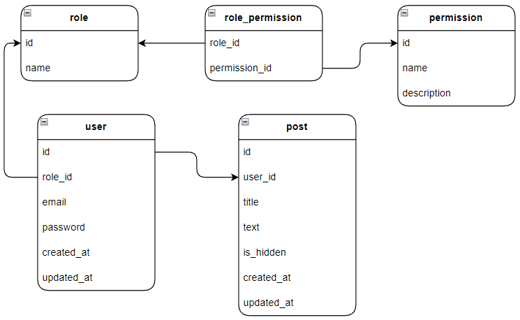

## Technologies
 - TypeScript
 - Nest.js
 - PostgreSQL
 - TypeORM
 - Docker Compose
 - JWT
 - and others

## Running the app with Docker

Copy sample .env:
```bash
cp .sample.env .env
```
and
```bash
docker compose up -d
```

By default, the backend runs on port 3000: [localhost:3000](http://localhost:3000).

Swagger is available here: [localhost:3000/api](http://localhost:3000/api).

## Database (PostgreSQL) schema
